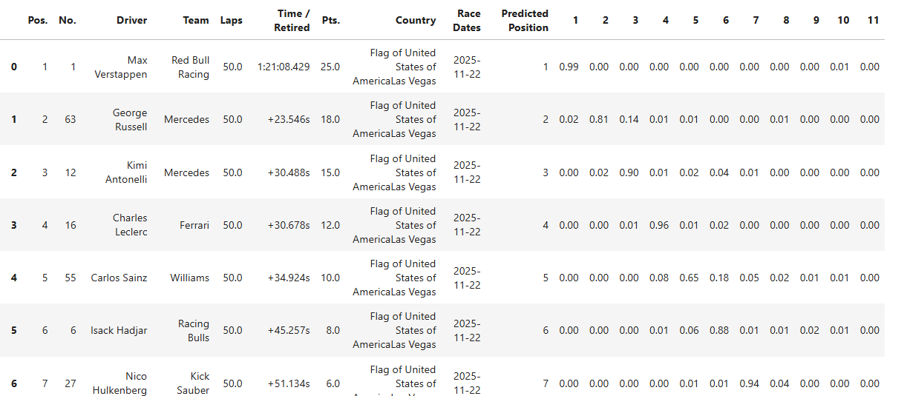
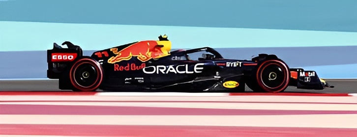

<h1>F1 Race Data Analysis & Position Prediction</h1>

This repository contains data scraping, preprocessing, and machine learning models
for analyzing Formula 1 race results and predicting driver positions.

<h2>Project Structure</h2>

<ul>
    <li><b>Data Scraping</b></li>
    <ul>
        <li>
            <a href="https://github.com/Hamid-progs/f1-race/blob/main/Data%20Scraping/Final_Scraper.ipynb">Result_Scraper.ipynb</a>  
            – Notebook used to scrape Formula 1 race results.
        </li>
        <li>
            f1_race_results(2015-2025).csv  
            – Scraped dataset containing Formula 1 race results from 2015 to 2025.
        </li>
    </ul>
    <li><b>001 Preprocessing.ipynb</b></li>
    <ul>
        <li>
            <a href="https://github.com/Hamid-progs/f1-race/blob/main/001%20Preprocessing.ipynb">001 Preprocessing.ipynb</a>  
            – Notebook used to clean and preprocess the scraped data.
        </li>
        <li>
            preprocessed.csv  
            – Contains preprocessed data for all drivers.
        </li>
        <li>
            2025_Drivers_preprocessed.csv  
            – Contains preprocessed data for only 2025 drivers.
        </li>
    </ul>
    <li><b>Position Prediction</b></li>
    <ul>
        <li>
            <a href="https://github.com/Hamid-progs/f1-race/blob/main/Position%20Prediction/Model_Selection.ipynb">
                model_selection.ipynb
            </a>
            – Model selection based on accuracy and evaluation metrics.
        </li>
        <li>
            <a href="https://github.com/Hamid-progs/f1-race/blob/main/Position%20Prediction/Driver_position_prediction.ipynb">
                Driver_position_prediction.ipynb
            </a>  
            – Predicts driver positions using 2025 data as the test dataset.
        </li>
    </ul>
    <li><b>Position Prediction Race Driver 2025</b></li>
    <ul>
        <li>
            This folder is similar to the Position Prediction folder.
        </li>
        <li>
            The difference is that predictions are made only for drivers
            participating in the 2026 Formula 1 race.
        </li>
    </ul>
    <li><b>img</b></li>
    <ul>
        <li>
            Contains images used in the project or documentation.
        </li>
    </ul>
</ul>
<h2>Kaggle Dataset</h2>

The Formula 1 race results dataset used in this project is also available on Kaggle:

<a href="https://www.kaggle.com/datasets/hamidrana/f1-race-results-2015-2025">
https://www.kaggle.com/datasets/hamidrana/f1-race-results-2015-2025
</a>

<h2>Result Image</h2>

<h2>Technologies Used</h2>

<ul>
    <li>Python</li>
    <li>BeautifulSoup</li>
    <li>Pandas</li>
    <li>NumPy</li>
    <li>Scikit-learn</li>
    <li>Model Used for Prediction RandomForestClassifier</li>
    <li>Jupyter Notebook</li>
</ul>

<h2>Author</h2>

<b>
Hamid-progs Contact via 
<a href="https://www.linkedin.com/in/muhammad-hamid-raza-082aa62ba">
<u>LinkedIn</u>
</a>
</b>

